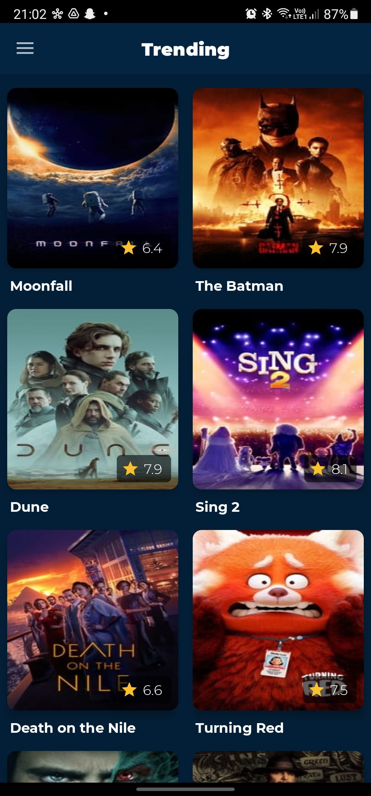
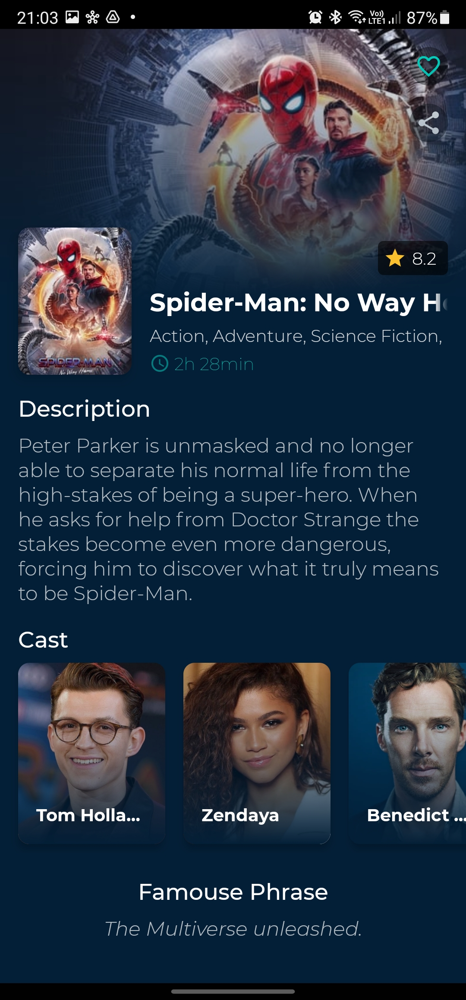
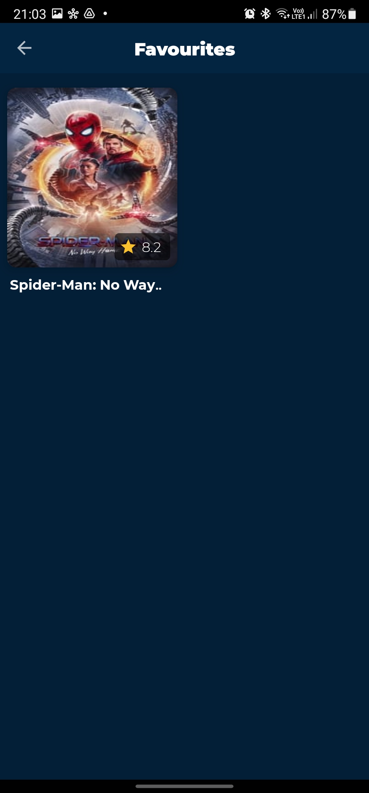

# MovieDB
  

This is a simple app which fetches movie data using [The Movie DB APIs](https://developers.themoviedb.org/3) and display it in list. Users can see Trending, Now Playing movies and they can also see movie details (genre, durations, cast, etc).

 

 | Movies List                         | Movie Detail                        | Favourites                          |
 |-------------------------------------|-------------------------------------|-------------------------------------|
 |     |   |   | 

## Features -

1. Beautiful UI/UX
2. Saves data in database for Offline Usage
3. Share movie detail via deeplink which directs directly to movie detail page
4. Bookmark movie as favourite

 

## Libraries Used - 

1. MVVM Architecture
2. Dagger 2
3. RX Java
4. Jetpack Navigation
5. Glide
6. Lottie Animation
7. Room DB

 

## Features coming soon -

1. Pagination - view multiple pages
2. Multiple types of movie support
3. See trailer of movies
